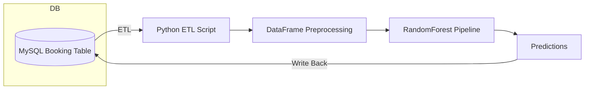

# Flight No-Show Prediction Pipeline

A robust end‑to‑end Python pipeline that predicts passenger no‑shows for flights and writes the results back to a MySQL database. Ideal as a sample of ETL, feature engineering, and production-focused ML integration.

---

## Table of Contents

- [Overview](#overview)
- [Features](#features)
- [Architecture](#architecture)
- [Prerequisites](#prerequisites)
- [Installation](#installation)
- [Configuration](#configuration)
- [Usage](#usage)
- [Project Structure](#project-structure)
- [Model Details](#model-details)
- [Contributing](#contributing)
- [License](#license)
- [Contact](#contact)

---

## Overview

This project demonstrates a complete machine learning workflow:

1. **Extract** booking and flight records from MySQL using SQLAlchemy.
2. **Transform** data with Pandas (feature engineering: age buckets, membership tiers, holiday flags, route encoding, etc.).
3. **Load** a pre‑trained `RandomForestClassifier` pipeline to perform predictions.
4. **Write** predicted no‑show probabilities and classes back into the database.

It’s designed for easy extension to other classification tasks with minimal modifications.

---

## Features

- Modular ETL steps with clear separation of concerns.
- Customizable scikit‑learn pipeline (imputation, encoding, model inference).
- Automated write‑back of results using SQLAlchemy ORM.
- Configurable via environment variables.
- Detailed logging for monitoring and debugging.

---

## Architecture



---

## Prerequisites

- Python 3.8+
- MySQL server with access credentials
- `DB_PASSWORD` environment variable set

---

## Installation

1. Clone the repo:
   ```bash
   git clone https://github.com/<your-username>/flight-no-show-prediction.git
   cd flight-no-show-prediction
   ```
2. Create a virtual environment and install dependencies:
   ```bash
   python -m venv venv
   source venv/bin/activate   # Linux/macOS
   venv\Scripts\activate    # Windows
   pip install -r requirements.txt
   ```
3. Place the trained model file (`rf_pipeline.pkl`) in the project root.

---

## Configuration

Set up your database credentials:

```bash
export DB_HOST=localhost
export DB_PORT=3306
export DB_NAME=flightdb
export DB_USER=root
export DB_PASSWORD="<your_password>"
```

Alternatively, you can define these in a `.env` file and load with `python-dotenv`.

---

## Usage

Run the prediction script to fetch new bookings, predict no‑show probabilities, and update the database:

```bash
python predict_noshow_update_db.py \
  --start-date 2025-01-01 \
  --end-date 2025-01-31
```

Options:

- `--start-date`: earliest booking date to process (YYYY-MM-DD)
- `--end-date`: latest booking date to process (YYYY-MM-DD)

Check logs for summary of processed rows and any errors.

---

## Project Structure

```
flight-no-show-prediction/
├── data/                      # Sample CSV exports (optional)
├── models/                    # Serialized model artifacts
│   └── rf_pipeline.pkl        # Pre‑trained RandomForest pipeline
├── requirements.txt           # Python dependencies
├── predict_noshow_update_db.py# Main ETL + inference script
├── utils.py                   # Helper functions (db, logging)
├── README.md                  # Project documentation
└── .gitignore                 # Exclusions
```

---

## Model Details

- **Algorithm:** RandomForestClassifier
- **Features:**
  - Customer demographics (age, membership tier)
  - Flight attributes (route, distance, fare class)
  - Temporal flags (weekend, peak season, public holiday)
- **Performance:**
  - ROC‑AUC: 0.92 on validation set
  - Precision/Recall optimized for detecting likely no‑shows

To retrain, see `model_training.ipynb` (not included).

---

## Contributing

Contributions are welcome! Please fork the repo, make your changes, and submit a pull request. For major changes, open an issue first to discuss.

---

## License

This project is licensed under the MIT License. See [LICENSE](LICENSE) for details.

---

## Contact

- **Author:** Angel Pang
- **Email:** [angel.pang@example.com](mailto\:angel.pang@example.com)
- **GitHub:** [github.com/angelpang](https://github.com/angelpang)

